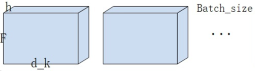

A link to the Pytorch version implemented by the Harvard NLP team https://github.com/harvardnlp/annotated-transformer

😄😄Not in the order of the original project code, in the order of my own understanding😄😄

### Let's start with the Attention function, which implements the multihead self-attention calculation in Transformer.
```bash
def attention(query, key, value, mask=None, dropout=None):

    d_k = query.size(-1)
    scores = torch.matmul(query, key.transpose(-2, -1))/math.sqrt(d_k)
    if mask is not None:
        scores = scores.masked_fill(mask == 0, -1e9)
    p_attn = F.softmax(scores, dim = -1)
    if dropout is not None:
        p_attn = dropout(p_attn)
    return torch.matmul(p_attn, value), p_attn
```

 Size (-1) is the size of the last dimension of the return matrix. In this function, query is a four-dimensional matrix (explained below), so the number of query columns is returned, that is, the length of the characters in the input sequence.
 
Then we multiply the matrix of query and key, divided by a scalar.

Then softmax, the resulting matrix is multiplied by the value matrix, and finally returns the multiplied matrix and P_attn, which I refer to as the weight matrix and P matrix.

### Then look at the implementation of the multi-headed self-attention mechanism class.
```bash
class MultiHeadedAttention(nn.Module):
    def __init__(self, h, d_model, dropout=0.1):
        super(MultiHeadedAttention, self).__init__()
        assert d_model % h == 0                             
        self.d_k = d_model // h
        self.h = h
        self.linears = clones(nn.Linear(d_model, d_model), 4)
        self.attn = None
        self.dropout = nn.Dropout(p=dropout)

    def forward(self, query, key, value, mask=None):
        if mask is not None:
            # Same mask applied to all h heads.
            mask = mask.unsqueeze(1)
        nbatches = query.size(0)

        # 1) Do all the linear projections in batch from d_model => h x d_k
        query, key, value = [l(x).view(nbatches, -1, self.h, self.d_k).transpose(1, 2) for l, x in zip(self.linears, (query, key, value))]
        # 2) Apply attention on all the projected vectors in batch.
        x, self.attn = attention(query, key, value, mask=mask, dropout=self.dropout)

        # 3) "Concat" using a view and apply a final linear.
        x = x.transpose(1, 2).contiguous().view(nbatches, -1, self.h * self.d_k)
        return self.linears[-1](x)
```
First, check whether d-model%h has a remainder. If there is a remainder, an error is reported

D-model is generally 512 (embedding length of sequence symbol) and h is generally 8. The length of D_k is obtained by dividing the two, that is, the number of columns in the query and key matrices. There is no principle in this, but the original paper did so.

```bash
def clones(module, N):
    return nn.ModuleList([copy.deepcopy(module) for _ in range(N)])
```
The function of the Clones function is to clone layers, but the parameters between these cloned layers are not shared.

In this case, self.linears is four fully connected layers with stacked inputs and outputs of 512.


*what is the difference nn.Linear() and nn.Embedding()?*
* The former mainly does linear weighting, while the latter supports index retrieval*
* In fact, the fundamental difference lies in the input, nn.Linear's input is a vector, and the output is also a vector, and the value range of elements of each dimension of the vector is continuous.  The input of nn.Embedding can only be discrete value, and the result can be obtained if only a discrete value is input, and this discrete value is actually equivalent to the vector after one-hot.*

and then is **forward** process.  The forward function can be called automatically, we just need to prepare the forward parameter.
```bash
query, key, value = [l(x).view(nbatches, -1, self.h, self.d_k).transpose(1, 2) for l, x in zip(self.linears, (query, key, value))]
```
This line in the forward function is the key code, which is the formation of the Q, K, V matrix.
The code means that the incoming Q, K and V 3d matrices are remolded into a four-dimensional matrix after a full connection layer, and the second three-dimensional transpose of the four-dimensional matrix.

The final result, as shown in the figure, is a four-dimensional matrix with dimensions B, h, F, and d_k. B is Batch-size, h is the number of heads in the multi-head self-attention mechanism, F is the number of characters in a sample, which can be understood as the number of words in a sentence, and d_k is the corresponding length of each character divided by h.

The function of **view** in Torch is similar to **reshape**,  The -1 parameter means let the machine guess. So if I have a matrix of size 1*24, view(-1,2,4), then this -1 is 3.

```bash
x, self.attn = attention(query, key, value, mask=mask, dropout=self.dropout)
```
This code calls the attention function and returns the weight matrix and the P matrix.

### Data flow details:

* Where F*F can be understood as the similarity score between each character (feature) in pairs, that is, p-matrix.
* Then the sum of each line after the P matrix Softmax is equal to 1, and then multiplied by the Value matrix to obtain the weight matrix.


* Each line of the weight matrix can be interpreted as the embedding of each character after the attention mechanism, that is, after considering the influence of all other characters.
* And the purpose of contiguous is to break the connection between copies. The forward function finally transposes the matrix back, and then goes through a full concatenation and then goes back out.

```bash
class PositionwiseFeedForward(nn.Module):
    def __init__(self, d_model, d_ff, dropout=0.1):
        super(PositionwiseFeedForward, self).__init__()
        self.w_1 = nn.Linear(d_model, d_ff)
        self.w_2 = nn.Linear(d_ff, d_model)
        self.dropout = nn.Dropout(dropout)

    def forward(self, x):
        return self.w_2(self.dropout(F.relu(self.w_1(x))))
```
PositionwiseFeedForward is a class that preprocesses the input to the decoder.

```bash
class Embeddings(nn.Module):
    def __init__(self, d_model, vocab):
        super(Embeddings, self).__init__()
        self.lut = nn.Embedding(vocab, d_model)
        self.d_model = d_model

    def forward(self, x):
        return self.lut(x) * math.sqrt(self.d_model)
```
Embeddings is an extension of the nn.embedding in torch.

```bash
class PositionalEncoding(nn.Module):
    def __init__(self, d_model, dropout, max_len=5000):
        super(PositionalEncoding, self).__init__()
        self.dropout = nn.Dropout(p=dropout)
        pe = torch.zeros(max_len, d_model)
        position = torch.arange(0, max_len).unsqueeze(1)
        div_term = torch.exp(torch.arange(0, d_model, 2) *
                             -(math.log(10000.0) / d_model))
        pe[:, 0::2] = torch.sin(position * div_term)
        pe[:, 1::2] = torch.cos(position * div_term)
        pe = pe.unsqueeze(0)
        self.register_buffer('pe', pe)

    def forward(self, x):
        x = x + Variable(self.pe[:, :x.size(1)], requires_grad=False)
        return self.dropout(x)
```
PositionalEncoding is the encoding of the encoder's position vector.

First, pe is [5000*512]，position is [5000*1]，div-term is[1*256]. so position*div-term is [5000*256],after sin、cos, pe is assigned to the even and odd columns。after unsqueeze, pe become [1\*5000\*512].

The purpose of register-buffer is to specify a constant in memory that is easy to write and read. This makes sense for common shared vectors such as position code vectors.

The forward function of this class implements the sum of character embedding and position embedding.

We've now looked at the multi-head self-attention mechanism, vector Embedding, and the location-encoded Embedding components. Now let's look at the final component summation normalization.

```bash
class LayerNorm(nn.Module):
    def __init__(self, features, eps=1e-6):
        super(LayerNorm, self).__init__()
        self.a_2 = nn.Parameter(torch.ones(features))
        self.b_2 = nn.Parameter(torch.zeros(features))
        self.eps = eps

    def forward(self, x):
        mean = x.mean(-1, keepdim=True)
        std = x.std(-1, keepdim=True)
        return self.a_2 * (x - mean) / (std + self.eps) + self.b_2
```
The first is the normalization layer. It's just a standardized formula.
```bash
class SublayerConnection(nn.Module):

    def __init__(self, size, dropout):
        super(SublayerConnection, self).__init__()
        self.norm = LayerNorm(size)
        self.dropout = nn.Dropout(dropout)

    def forward(self, x, sublayer):
        return x + self.dropout(sublayer(self.norm(x)))
```
Add operation layer.  

All the basic components have been explained.

### The rest of the code has no computational logic, just architectural logic.
 There are five classes left: EncoderLayer、DecoderLayer、Encoder、Decoder、EncoderDecoder.  The first two are respectively to build an encoder, decoder in a specific layer. The third, the fourth is encoder, decoder, in fact, is constantly copy the first two layers, interspersed with standardization layer.  The last one is the whole Transformers model class, which integrates the encoder and decoder together.
 ```bash
 class EncoderLayer(nn.Module):
    def __init__(self, size, self_attn, feed_forward, dropout):
        super(EncoderLayer, self).__init__()
        self.self_attn = self_attn
        self.feed_forward = feed_forward
        self.sublayer = clones(SublayerConnection(size, dropout), 2)
        self.size = size

    def forward(self, x, mask):
        x = self.sublayer[0](x, lambda x: self.self_attn(x, x, x, mask))
        return self.sublayer[1](x, self.feed_forward)
 ```
According to this code, the detailed architecture diagram of the encoder is drawn as follows:


```bash
class Encoder(nn.Module):
    def __init__(self, layer, N):
        super(Encoder, self).__init__()
        self.layers = clones(layer, N)
        self.norm = LayerNorm(layer.size)

    def forward(self, x, mask):
        for layer in self.layers:
            x = layer(x, mask)
        return self.norm(x)
```
 This is the encoder class, which loops through specific coding layers and normalizes between layers.
 ```bash
 class DecoderLayer(nn.Module):
    def __init__(self, size, self_attn, src_attn, feed_forward, dropout):
        super(DecoderLayer, self).__init__()
        self.size = size
        self.self_attn = self_attn
        self.src_attn = src_attn
        self.feed_forward = feed_forward
        self.sublayer = clones(SublayerConnection(size, dropout), 3)

    def forward(self, x, memory, src_mask, tgt_mask):
        m = memory
        x = self.sublayer[0](x, lambda x: self.self_attn(x, x, x, tgt_mask))
        x = self.sublayer[1](x, lambda x: self.src_attn(x, m, m, src_mask))
        return self.sublayer[2](x, self.feed_forward)
 ```
The decoder architecture drawn according to the code is shown below:

```bash
class Decoder(nn.Module):
    "Generic N layer decoder with masking."

    def __init__(self, layer, N):
        super(Decoder, self).__init__()
        self.layers = clones(layer, N)
        self.norm = LayerNorm(layer.size)

    def forward(self, x, memory, src_mask, tgt_mask):
        for layer in self.layers:
            x = layer(x, memory, src_mask, tgt_mask)
        return self.norm(x)
```
The decoder class is similar to the encoder class in that it loops through the decoding layer and normalizes between layers. However, the forward function of the decoder has a memory parameter, which is used to receive the matrix from the encoder.
```bash
class EncoderDecoder(nn.Module):
    def __init__(self, encoder, decoder, src_embed, tgt_embed, generator):
        super(EncoderDecoder, self).__init__()
        self.encoder = encoder
        self.decoder = decoder
        self.src_embed = src_embed
        self.tgt_embed = tgt_embed
        self.generator = generator

    def forward(self, src, tgt, src_mask, tgt_mask):
        return self.decode(self.encode(src, src_mask), src_mask, tgt, tgt_mask)

    def encode(self, src, src_mask):
        return self.encoder(self.src_embed(src), src_mask)

    def decode(self, memory, src_mask, tgt, tgt_mask):
        return self.decoder(self.tgt_embed(tgt), memory, src_mask, tgt_mask)
```
This is the final class that implements the entire Transformer architecture. The forward function of this class implements the connection between the encoder and decoder.

self.encode(src,src_mask)is the actual parameter of parameter memory.
```bash
def __init__(self, encoder, decoder, src_embed, tgt_embed, generator):
```
This is the initialization function, src-embed is the encoder's input (training sample), tgt-embed is the decoder's input (tag sample) (for example, in machine translation tasks, src is the original text, tgt is the translated text)
```bash
def encode(self, src, src_mask):
    return self.encoder(self.src_embed(src), src_mask)
```
The encode function implements embedding processing on the input and sends it to the encoder.
```bash
def make_model(src_vocab, tgt_vocab, N=6, d_model=512, d_ff=2048, h=8, dropout=0.1):
    c = copy.deepcopy
    attn = MultiHeadedAttention(h, d_model)
    ff = PositionwiseFeedForward(d_model, d_ff, dropout)
    position = PositionalEncoding(d_model, dropout)
    model = EncoderDecoder(
        Encoder(EncoderLayer(d_model, c(attn), c(ff), dropout), N),
        Decoder(DecoderLayer(d_model, c(attn), c(attn),c(ff), dropout), N),
        nn.Sequential(Embeddings(d_model, src_vocab), c(position)),
        nn.Sequential(Embeddings(d_model, tgt_vocab), c(position)),
        Generator(d_model, tgt_vocab))
```
The last make-model function is to instantiate the Transformer